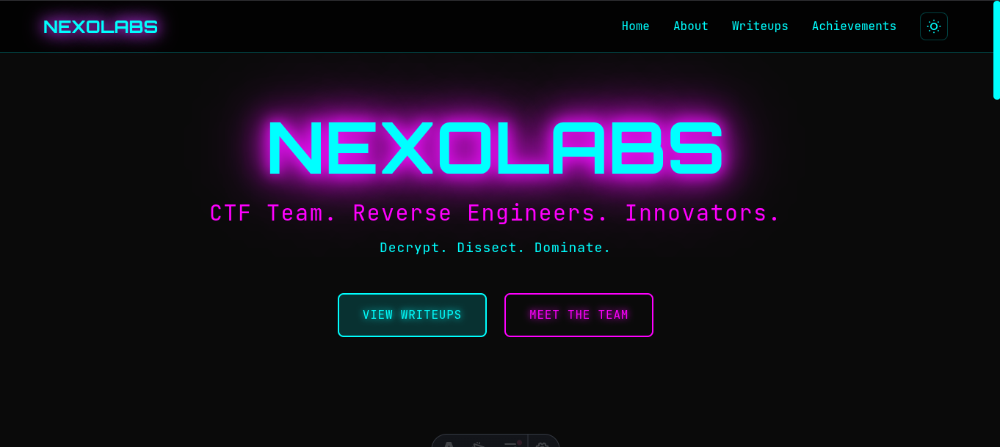

<h1 align="center"> ⛳ NexoLabs</h1>

<p align="center">
<a href="https://github.com/nexolab-team/nexolabs"></a><br />
<i>Modern CTF team website with cyberpunk aesthetics</i><br />
<i>Showcase writeups, achievements, and team members</i><br /><br />
<b>🌐 <a href="https://nexolab-team.github.io/nexolabs/">nexolab-team.github.io/nexolabs</a></b>
</p>

<p align="center">

</p>

<p align="center">


</p>

> **Decrypt. Dissect. Dominate.** - A modern, cyberpunk-themed website for showcasing CTF writeups and team achievements.

## Motive

Why waste time manually updating portfolio sites when you can focus on solving challenges? NexoLabs eliminates the hassle of traditional CTF team sites. Just write your markdown writeups and push to GitHub—your showcase updates automatically. Built with Astro 5 for lightning-fast performance and SEO optimization.

---

## ✨ Features

<details>
<summary><b>🎨 UI/UX Features</b></summary>

- 🎨 **Cyberpunk Theme** - Dark mode with cyan/magenta neon aesthetics
- 📱 **Fully Responsive** - Mobile-first design with hamburger menu
- 🌓 **Theme Toggle** - Dark/Light mode with localStorage persistence
- 🎯 **Custom 404** - Themed error page with navigation
- ✨ **3D Effects** - Vanilla Tilt on team cards
- 🎭 **Animations** - Smooth transitions and hover effects

</details>

<details>
<summary><b>📝 Content Features</b></summary>

- 📝 **Content Collections** - Markdown writeups with frontmatter metadata
- 🏷️ **Tags System** - Categorize and filter content
- 🔍 **Advanced Search** - Real-time filtering, sorting, and pagination
- ⏱️ **Reading Time** - Auto-calculated reading estimates
- 📰 **RSS Feed** - Stay updated with latest writeups

</details>

<details>
<summary><b>🚀 Technical Features</b></summary>

- 🔒 **Security Headers** - CSP, X-Frame-Options, and more
- 🚀 **Auto-Deploy** - GitHub Actions CI/CD pipeline
- ⚡ **Static Generation** - Lightning-fast page loads
- 🔧 **Type-Safe** - TypeScript and Zod validation

</details>

---

<details>
<summary><b>🚀 Project Structure</b></summary>

```text
nexolabs/
├── .github/
│   └── workflows/          # CI/CD pipelines
│       ├── deploy.yml      # Auto-deploy to GitHub Pages
│       └── ci.yml          # Code quality checks
├── public/
│   ├── favicon.svg         # Custom cyberpunk favicon
│   └── assets/
│       ├── avatars/        # Team member photos
│       └── images/         # Optimized images
├── src/
│   ├── components/
│   │   ├── Navbar.astro    # Responsive navigation
│   │   ├── Footer.astro    # Site footer
│   │   ├── WriteupCard.astro  # Writeup preview cards
│   │   ├── Lightbox.astro  # Image lightbox
│   │   └── GlitchIntro.astro  # Hero animation
│   ├── content/
│   │   ├── config.ts       # Content collections schema
│   │   └── writeups/       # Markdown writeups
│   ├── layouts/
│   │   └── Layout.astro    # Base layout with theme system
│   └── pages/
│       ├── index.astro     # Homepage
│       ├── writeups.astro  # Writeups listing with filters
│       ├── about.astro     # Team information
│       ├── achievements.astro  # Stats and accomplishments
│       ├── 404.astro       # Custom error page
│       ├── rss.xml.js      # RSS feed generator
│       └── writeups/
│           └── [slug].astro  # Dynamic writeup pages
├── astro.config.mjs        # Astro configuration
├── tailwind.config.mjs     # Tailwind customization
├── package.json            # Dependencies
└── DEPLOYMENT_GUIDE.md     # Deployment instructions
```

</details>

---

<details>
<summary><b>🛠️ Tech Stack</b></summary>

- **Framework**: [Astro 5](https://astro.build/) - Static site generator
- **Styling**: [Tailwind CSS 3](https://tailwindcss.com/) - Utility-first CSS
- **Fonts**: Orbitron (headings) + JetBrains Mono (code)
- **Content**: Markdown with frontmatter + Content Collections
- **Interactions**: Vanilla Tilt for 3D effects
- **RSS**: @astrojs/rss for feed generation
- **CI/CD**: GitHub Actions for automated deployment

</details>

---

## 🚀 Quick Start

```bash
# Clone the repo
git clone https://github.com/nexolab-team/nexolabs.git
cd nexolabs

# Install dependencies
npm install

# Run dev server
npm run dev

# Open browser at http://localhost:4321
```

<details>
<summary><b>🧞 Available Commands</b></summary>

| Command                   | Action                                           |
| :------------------------ | :----------------------------------------------- |
| `npm install`             | Installs dependencies                            |
| `npm run dev`             | Starts local dev server at `localhost:4321`      |
| `npm run build`           | Build production site to `./dist/`               |
| `npm run preview`         | Preview build locally before deploying           |
| `npm run astro ...`       | Run CLI commands like `astro add`, `astro check` |

</details>

---

<details>
<summary><b>📝 Adding Content</b></summary>

### Add a New Writeup

1. Create a new `.md` file in `src/content/writeups/`:

```markdown
---
title: "Your Writeup Title"
description: "Brief description"
date: "2025-01-15"
author: "YourName"
category: "Web"
difficulty: "Medium"
tags: ["XSS", "SQLi", "Authentication"]
featured: true
---

Your content here...
```

2. Add images to `public/images/writeups/`
3. The writeup automatically appears on the site!

### Add Team Member

1. Edit `src/pages/about.astro`
2. Add avatar to `public/assets/avatars/`
3. Copy a team member card block
4. Update name, role, links, and image path

</details>

---

<details>
<summary><b>🎨 Customization</b></summary>

### Colors

Edit `tailwind.config.mjs` to change the color scheme:

```javascript
colors: {
  'cyan': { ... },      // Primary accent
  'magenta': { ... },   // Secondary accent
}
```

### Site Info

Update `astro.config.mjs`:

```javascript
site: 'https://your-domain.com',
```

### Theme Variables

Theme variables in `src/layouts/Layout.astro`:
- Background colors
- Text colors
- Accent colors
- Shadows and effects

</details>

---

<details>
<summary><b>🚀 Deployment</b></summary>

### Automatic (Recommended)

Push to `main` branch - GitHub Actions handles the rest!

```bash
git add .
git commit -m "Update content"
git push origin main
```

**Setup:**
1. Enable GitHub Pages (Settings → Pages → Source: GitHub Actions)
2. Push code to GitHub
3. Wait 2-3 minutes
4. Site is live! 🎉

### Manual

```bash
npm run build
# Upload ./dist/ to your hosting provider
```

### Other Platforms
- **Vercel**: One-click import from GitHub
- **Netlify**: Connect repo and deploy
- **Cloudflare Pages**: GitHub integration

</details>

---

<details>
<summary><b>🔧 Configuration Files</b></summary>

- `astro.config.mjs` - Astro settings
- `tailwind.config.mjs` - Tailwind customization
- `tsconfig.json` - TypeScript config
- `.github/workflows/deploy.yml` - Deployment pipeline
- `.github/workflows/ci.yml` - Quality checks

</details>

---

<details>
<summary><b>📚 Architecture & Workflow</b></summary>

1. Write markdown files in `src/content/writeups/`
2. Astro processes them with Content Collections API
3. Pages auto-generate with search, filter, and pagination
4. Push to GitHub → Actions build and deploy to Pages
5. RSS feed auto-updates at `/rss.xml`

</details>

---

<details>
<summary><b>🎯 Browser Support</b></summary>

- ✅ Chrome/Edge (latest)
- ✅ Firefox (latest)
- ✅ Safari (latest)
- ✅ Mobile browsers

</details>

---

<details>
<summary><b>💡 Tips & Best Practices</b></summary>

- Use `npm run build && npm run preview` to test before deploying
- Images auto-optimize - just add them to public folder
- Dark mode persists across sessions
- RSS feed updates automatically at `/rss.xml`
- Use `featured: true` in writeup frontmatter to highlight best content

</details>

---

## 🤝 Contributing

This is a team project for NexoLabs. For external contributions:

1. Fork the repository
2. Create a feature branch
3. Make your changes
4. Submit a pull request

---

## 🔗 Links

- [Live Site](https://nexolab-team.github.io/nexolabs)
- [Documentation](https://docs.astro.build)
- [Tailwind Docs](https://tailwindcss.com/docs)

---

## 📄 License

> _**[NexoLabs](https://github.com/nexolab-team/nexolabs)** is licensed under [MIT](https://github.com/nexolab-team/nexolabs/blob/HEAD/LICENSE) © [NexoLabs Team](https://github.com/nexolab-team) 2025._<br>

<details>
<summary>Expand License</summary>

```
The MIT License (MIT)

Copyright (c) NexoLabs Team

Permission is hereby granted, free of charge, to any person obtaining a copy 
of this software and associated documentation files (the "Software"), to deal 
in the Software without restriction, including without limitation the rights 
to use, copy, modify, merge, publish, distribute, sub-license, and/or sell 
copies of the Software, and to permit persons to whom the Software is furnished 
to do so, subject to the following conditions:

The above copyright notice and this permission notice shall be included in all 
copies or substantial portions of the Software.

THE SOFTWARE IS PROVIDED "AS IS", WITHOUT WARRANTY OF ANY KIND, EXPRESS OR IMPLIED,
INCLUDING BUT NOT LIMITED TO THE WARRANTIES OF MERCHANTABILITY, FITNESS FOR A
PARTICULAR PURPOSE AND NON INFRINGEMENT. IN NO EVENT SHALL THE AUTHORS OR COPYRIGHT
HOLDERS BE LIABLE FOR ANY CLAIM, DAMAGES OR OTHER LIABILITY, WHETHER IN AN ACTION
OF CONTRACT, TORT OR OTHERWISE, ARISING FROM, OUT OF OR IN CONNECTION WITH THE
SOFTWARE OR THE USE OR OTHER DEALINGS IN THE SOFTWARE.
```

</details>

---

<!-- License + Copyright -->
<p align="center">
  <i>© <a href="https://github.com/nexolab-team">NexoLabs Team</a> 2025</i><br>
  <i>Licensed under <a href="https://github.com/nexolab-team/nexolabs/blob/main/LICENSE">MIT</a></i><br>
  <sup>Decrypt. Dissect. Dominate.</sup>
</p>

<!-- ASCII Art -->
<!-- 
                    🔐 CTF Excellence 🔐
                    
         ╔═══════╗
         ║ ◢███◣ ║
         ║ █▓▓▓█ ║    "Hack the planet!"
         ║ ◥███◤ ║
         ╚═══╤═══╝
            ╱│╲
           ╱ │ ╲
          ╱  │  ╲
         ╱   │   ╲
        ╱    │    ╲
       ◢═════╧═════◣
         
    ~~~~~~~~~~~~~~~~~~~~~~~~~~~~~~~~~
       N E X O L A B S   2 0 2 5
    ~~~~~~~~~~~~~~~~~~~~~~~~~~~~~~~~~
-->

---

**Made with ❤️ by the NexoLabs Team**

*Decrypt. Dissect. Dominate.*
